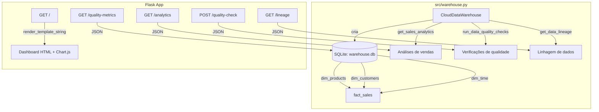
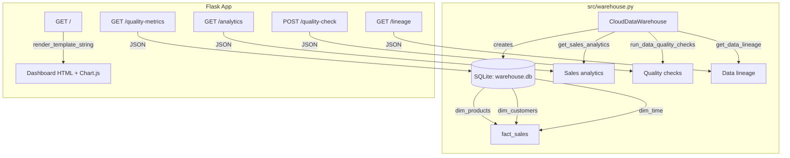

# Cloud-Data-Warehouse

[Português](#português) | [English](#english)

---

## Português

### Descrição

Demonstração de Data Warehouse em nuvem simulado com SQLite, pipeline de dados com pandas e dashboard Flask para análise de vendas.

Este projeto implementa a classe `CloudDataWarehouse` que cria um esquema estrela (star schema) em SQLite com tabelas de dimensão e fato, gera dados de exemplo, executa análises de vendas e verificações de qualidade de dados, e serve um dashboard web via Flask.

### O que o projeto faz

- **Esquema estrela em SQLite**: Tabelas `dim_products`, `dim_customers`, `dim_time` e `fact_sales`
- **Geração de dados de exemplo**: 5 clientes, 5 produtos, 90 dias de dimensão temporal e 200 transações de vendas aleatórias
- **Análises de vendas**: Receita total, lucro total, valor médio por transação, vendas por categoria, vendas por país, tendências mensais
- **Verificações de qualidade de dados**: Contagem de nulos em campos críticos, verificação de e-mails duplicados, consistência de receita
- **Rastreamento de linhagem de dados**: Retorna um dicionário estático descrevendo fontes, transformações e destinos
- **Dashboard Flask**: Interface web HTML com gráficos Chart.js para visualização dos dados de vendas, qualidade e linhagem

### O que o projeto NÃO possui

- Infraestrutura em nuvem real (usa SQLite local)
- Processamento paralelo
- Configuração via YAML/JSON
- Sistema de alertas
- Containerização (Docker)
- CI/CD

### Tecnologias

| Tecnologia | Uso |
|---|---|
| Python | Linguagem principal |
| Flask | Servidor web e API REST |
| pandas | Consultas SQL retornadas como DataFrames |
| SQLite | Banco de dados local (simulando data warehouse) |

### Arquitetura



### Como executar

```bash
git clone https://github.com/galafis/Cloud-Data-Warehouse.git
cd Cloud-Data-Warehouse

python -m venv venv
source venv/bin/activate  # Windows: venv\Scripts\activate

pip install -r requirements.txt

python src/warehouse.py
```

O dashboard estará disponível em `http://localhost:5000`.

### Testes

O projeto possui 5 testes básicos que verificam:

1. Criação das tabelas no banco de dados
2. Carregamento dos dados de exemplo
3. Retorno correto das análises de vendas
4. Execução das verificações de qualidade de dados
5. Retorno da linhagem de dados

```bash
pytest tests/test_warehouse.py -v
```

### Estrutura do Projeto

```
Cloud-Data-Warehouse/
├── src/
│   ├── __init__.py
│   └── warehouse.py
├── tests/
│   └── test_warehouse.py
├── requirements.txt
├── LICENSE
└── README.md
```

### Licença

Este projeto está licenciado sob a Licença MIT - veja o arquivo [LICENSE](LICENSE) para detalhes.

---

## English

### Description

Simulated cloud Data Warehouse demonstration using SQLite, data pipeline with pandas, and Flask dashboard for sales analysis.

This project implements the `CloudDataWarehouse` class, which creates a star schema in SQLite with dimension and fact tables, generates sample data, runs sales analytics and data quality checks, and serves a web dashboard via Flask.

### What the project does

- **Star schema in SQLite**: Tables `dim_products`, `dim_customers`, `dim_time`, and `fact_sales`
- **Sample data generation**: 5 customers, 5 products, 90 days of time dimension, and 200 random sales transactions
- **Sales analytics**: Total revenue, total profit, average transaction value, sales by category, sales by country, monthly trends
- **Data quality checks**: Null counts on critical fields, duplicate email detection, revenue consistency checks
- **Data lineage tracking**: Returns a static dictionary describing sources, transformations, and targets
- **Flask dashboard**: HTML web interface with Chart.js graphs for visualizing sales data, quality metrics, and lineage

### What the project does NOT have

- Real cloud infrastructure (uses local SQLite)
- Parallel processing
- YAML/JSON configuration
- Alerting system
- Containerization (Docker)
- CI/CD

### Tech Stack

| Technology | Usage |
|---|---|
| Python | Main language |
| Flask | Web server and REST API |
| pandas | SQL queries returned as DataFrames |
| SQLite | Local database (simulating data warehouse) |

### Architecture



### How to run

```bash
git clone https://github.com/galafis/Cloud-Data-Warehouse.git
cd Cloud-Data-Warehouse

python -m venv venv
source venv/bin/activate  # Windows: venv\Scripts\activate

pip install -r requirements.txt

python src/warehouse.py
```

The dashboard will be available at `http://localhost:5000`.

### Tests

The project has 5 basic tests that verify:

1. Database table creation
2. Sample data loading
3. Correct sales analytics response
4. Data quality checks execution
5. Data lineage response

```bash
pytest tests/test_warehouse.py -v
```

### Project Structure

```
Cloud-Data-Warehouse/
├── src/
│   ├── __init__.py
│   └── warehouse.py
├── tests/
│   └── test_warehouse.py
├── requirements.txt
├── LICENSE
└── README.md
```

### License

This project is licensed under the MIT License - see the [LICENSE](LICENSE) file for details.
